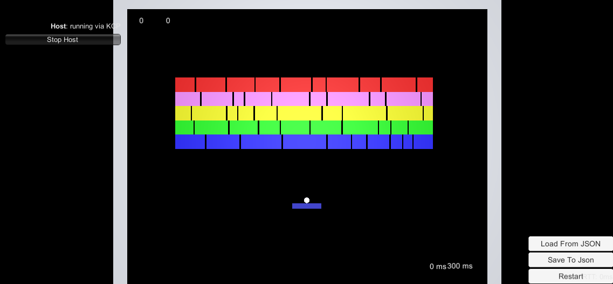

This is a test task project.

This project is using the Microsft Framework naming guideline
https://docs.microsoft.com/en-us/dotnet/standard/design-guidelines/naming-guidelines, except field/property names: they are in the lowerCase instead of UpperCase (as it usually for Unity).

About the project:

1. TaskTracker.docx - all the test task split into small tasks and this document is for tracking them.
2. Mirror - mirror framework.

